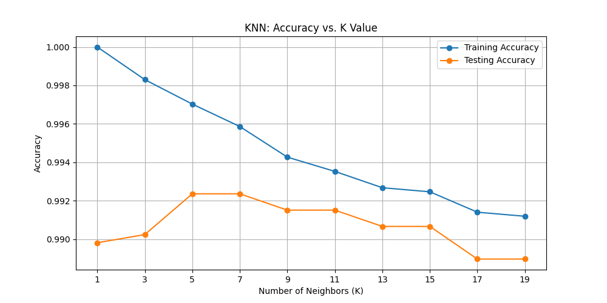
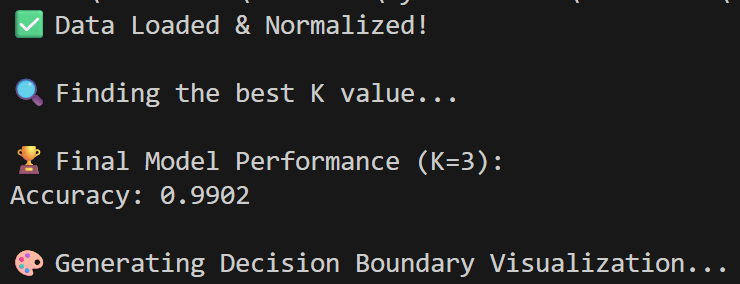
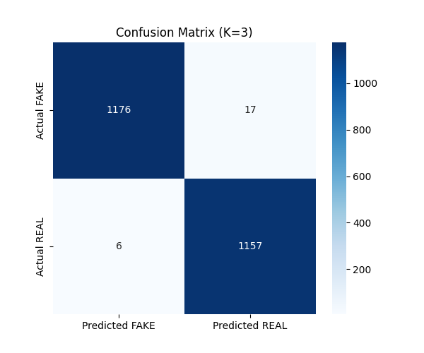
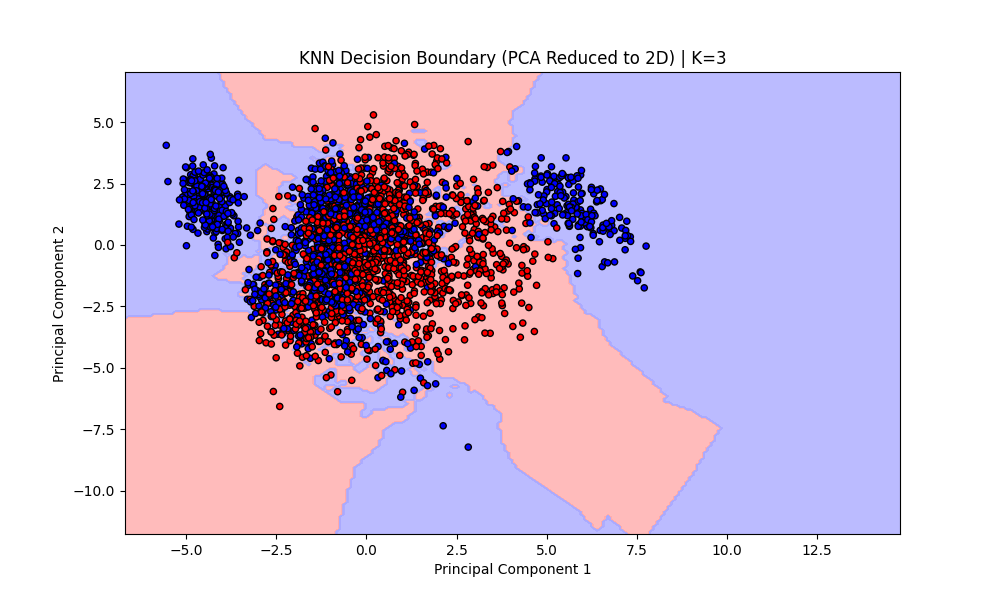

# 🗣️ DeepFake Voice Recognition: K-Nearest Neighbors (KNN)

## 📌 Project Overview
This project tackles one of the most critical modern challenges: **DeepFake Voice Detection**. Using a balanced dataset of 11,778 audio samples (Real vs. Fake), this project implements a **K-Nearest Neighbors (KNN)** classification model to distinguish between authentic human voices and AI-generated deepfakes based on 26 distinct acoustic features (MFCCs, Chroma, RMS, Spectral Centroid, etc.).

Through this project, I practically implemented distance-based machine learning, demonstrated the critical importance of feature scaling, utilized the Elbow Method for hyperparameter tuning, and visualized high-dimensional decision boundaries using PCA.

## 🛠️ Technologies & Libraries Used
* **Python 3.x**
* **Pandas & NumPy:** Data handling and array manipulation
* **Scikit-Learn (sklearn):** `KNeighborsClassifier`, `StandardScaler`, `PCA` (Principal Component Analysis), and evaluation metrics (`accuracy_score`, `confusion_matrix`)
* **Matplotlib & Seaborn:** Data visualization and decision boundary mapping

## 🚀 Pipeline Steps & Key Insights

### 1. Data Normalization (The Golden Rule of KNN)
KNN relies on calculating the Euclidean distance between data points. Because audio features vary wildly in scale (e.g., `rolloff` is in thousands, while `rms` is a tiny decimal), I applied **StandardScaler**. This prevents large-scale features from dominating the distance calculations, ensuring all acoustic clues are weighed equally.

### 2. Hyperparameter Tuning: Finding the Optimal 'K'
To find the perfect balance between overfitting and underfitting, I tested multiple odd values for 'K' (number of neighbors) and plotted an Elbow Curve. This visual approach helps identify the exact point where testing accuracy peaks before the model becomes too generalized.

### 3. Final Model Evaluation
After selecting the optimal `K=3`, the final model was trained and evaluated on unseen testing data. The terminal output confirms the high accuracy of the tuned model.

To further break down the performance, I generated a Confusion Matrix to analyze exactly how many Real and Fake voices were correctly identified versus misclassified (False Positives/False Negatives).

### 4. High-Dimensional Decision Boundary Visualization
Since the dataset has 26 dimensions (features), it is impossible for humans to visualize the raw KNN splits. To solve this, I applied **Principal Component Analysis (PCA)** to compress the 26 dimensions down to 2 principal components. The resulting plot visualizes exactly how the KNN algorithm draws the boundary between "FAKE" (Red) and "REAL" (Blue) territories in a 2D space.

